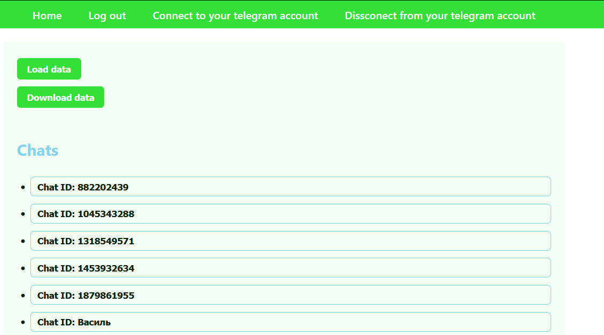

# Social media message viewing system


# Table of contents
- [Social media message viewing system](#social-media-message-viewing-system)
- [Table of contents](#table-of-contents)
  - [Description](#description)
  - [Usage](#usage)
  - [Installation](#installation)
    - [Telegram Api](#telegram-api)
    - [Backend](#backend)
    - [Frontend](#frontend)
  - [Contributing](#contributing)
  - [License](#license)

## Description

An app that allows you to connect your Telegram account and view a list of all your account chats and messages. 

## Usage
- Go to sign up and log creete account
- Go to sign in and log in
- Go to Connect your telegram account to connect your telegram account
- Go to Disconnect from your telegram account to disconnect from your telegram account
- Go to Home
- Press Load data to get all messages from telegram
- Press Download data to download all messages from telegram in json file
- Press Logout to logout

## Installation

1. Download git repository 
```bash
git clone https://github.com/Vasya-556/Social-media-message-viewing-system
cd Social-media-message-viewing-system
```

### Telegram Api

1. Visit [site](https://my.telegram.org/)
2. In backend folder create file ".env"
3. Save api_id and api_hash as API_ID and API_HASH respectively 

### Backend

1. Create virtual enviroment
```bash
python -m venv env
```
2. Start the env
```bash
# On Windows: 
env\Scripts\activate
# On Linux: 
source env/bin/activate   
```
3. Install dependencies
```bash
pip install -r requirements.txt
```
4. Run server
```bash
cd backend
python main.py
```

### Frontend

1. Go to frontend folder
```bash
cd frontend
```
2. Install dependencies:
```bash
npm install
```
3. Start server
```bash
npm start
```

## Contributing

Pull requests are welcome.

## License

[MIT](LICENSE)